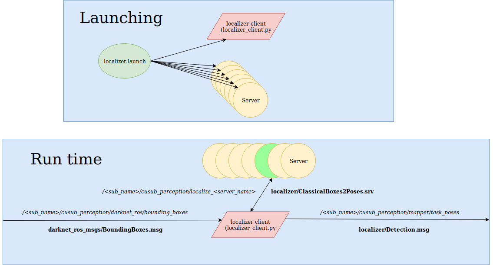

*********
Localizer
*********

The localizer package takes in a darknet image with bounding boxes and outputs relative poses of objects to the mapper. It consists of a client script and classical cv analyzing rosservers. It can be configured via the _object_localizers_ tag in mission_config.yaml.

Launching
#########

::

    roslaunch localizer localizer.launch

Structure and Functionality
###########################

In this section, when we say "localizer" we are referring to the localizer client. Upon receiving a BoundingBoxes.msg from darknet_ros the localizer loops through each box. It does a lookup in the rosparameter server to determine which  servers it can use to localize a particular class. It creates requests for all of these servers. If 2+ classes indicate they use the same server, it will combine their requests into one request.

It will then send these requests to each rosserver. If multiple servers are provided for a particular class, it will send each request in the order listed in the mission_config.yaml file. The rosservers will take in the image and the bounding box(es) and attempt via classical cv methods to create a relative pose of the object.

If the rosserver fails, it will return a "Failed" string in the Classical2Boxes response. The localizer will then proceed to interrogate the next server it knows it can use to localize that class. If the localizer receives an object class, it will publish the relative pose as a detection msg to the mapper and cancel all future server requests of that particular class.

Configuration
#############

In mission_config/config/mission_config.yaml, in a class's object_localizer tag, provide the **darknet class** and **server or list of servers** (in order of priority) for the localizer client to call. Example:
::
    tasks:
     start_gate:
      prior: [4,-1,-1.5]
      search_alg: simple
      dist_behind_gate: 1.0
      failed_repeat: true   # If aborted, repeat the task?
      object_localizers:
        start_gate_pole: ['gate_pnp_color', 'gate_midpoint']

     dice:
      prior: [1,1,-1]
      search_alg: simple
      failed_repeat: false
      object_localizers:
        dice1: dice_box
        dice2: dice_box
        dice5: dice_box
        dice6: dice_box
    mission_tasks: # Tasks To Do In Order
     - start_gate

Writing a New Server
####################

There are 2 parts to localizing server: **ros front end** and **image analyzing backend**. The ros front end is located in **localizer/scripts/<class>_servers/**. It will receive a ClassicalBoxes2Poses.msg and use its image analyzing backend (located in **localizer/src/classical_cv/**) to locate its object. We recommend writing the backend first to prototype your classical cv method. Try to keep pixel analysis solely in the backend. For example, if using the popular `pnp technique <https://docs.opencv.org/2.4/modules/calib3d/doc/camera_calibration_and_3d_reconstruction.html>`_ then your backend may find pixels while your front end calls cv2.solvePnP and returns the pose.

Reference
####################

Localizer
---------------

.. doxygenfile:: localizer.h
    :project: localizer
    :sections: public-type innernamespace innerclass func private-func

jiangshi_watershed
--------------------

.. doxygenfile:: jiangshi_watershed.h
    :project: localizer
    :sections: public-type innernamespace innerclass func private-func

pose_generator
--------------------

.. doxygenfile:: pose_generator.h
    :project: localizer
    :sections: public-type innernamespace innerclass func private-func

start_gate_hough
--------------------

.. doxygenfile:: start_gate_hough.h
    :project: localizer
    :sections: public-type innernamespace innerclass func private-func

