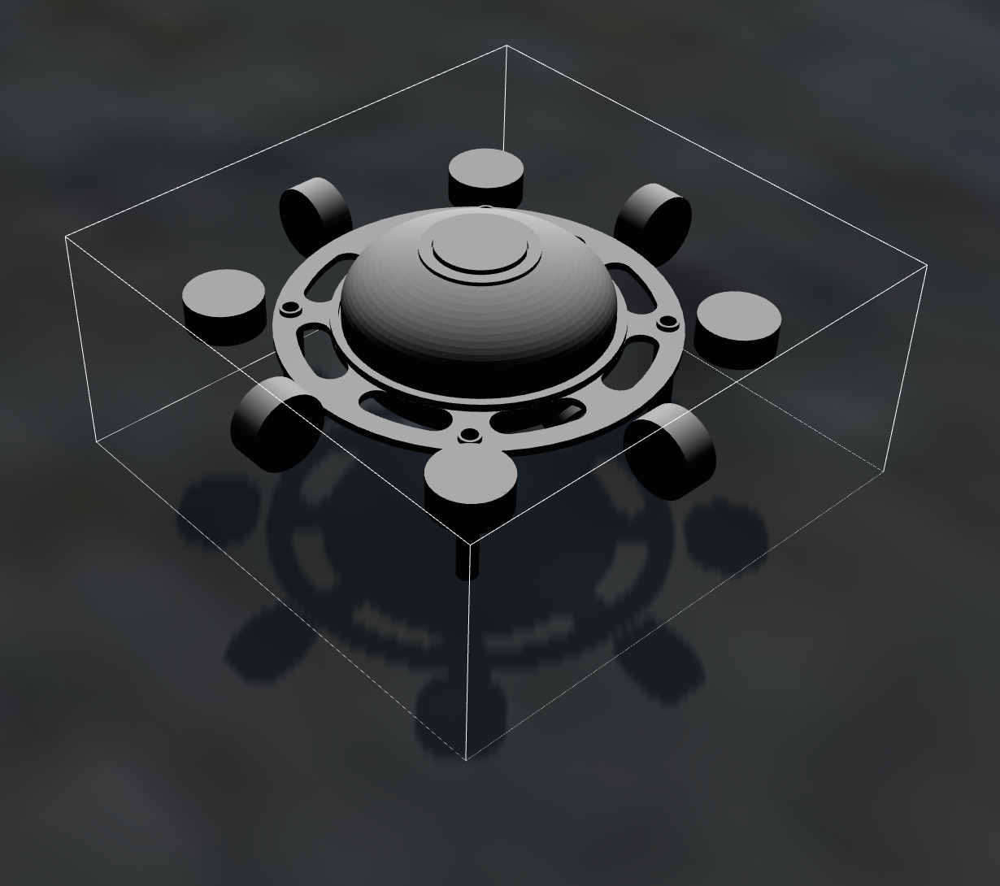
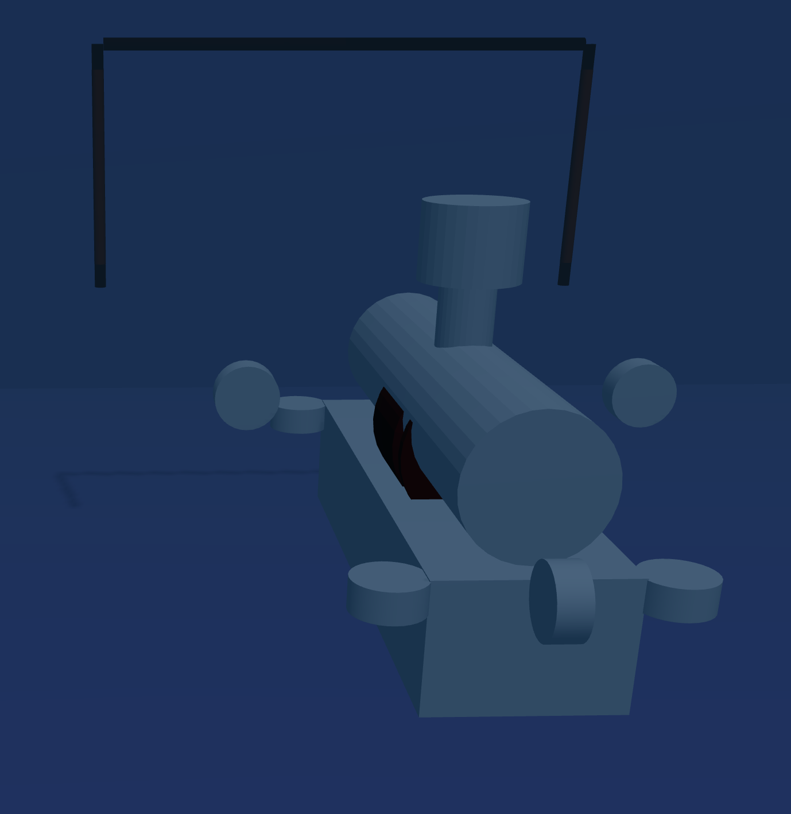

*********************
leviathan_description
*********************

This folder contains the structure and files for the uuv_simulator to properly model Leviathan and Triton. 

Urdf Folder
###########

The urdf is the heart of the sub's physical simulation. 

**Actuators.xacro**: This positions all the motors and other objects that can influence the sub's pose, again in meters. 

**Sensors.xacro**: This positions all the sensors on the sub. Besides the camera poses, the other sensor positions do not matter as much since they will copy position data from gazebo using a few scripts and provide an accuracy within our standard error calculations. 

**Snippets.xacro**: adds extra descriptions and data to the sensors and actuators. This file links the sensors/thrusters to physical objects (with optional meshes) and provides data on how the object functions. The data includes camera distortions, FoV, and resolution, along with thruster dynamics and models for force. 

**Base.xarco**: links together all the files in the urdf folder and sets up extra sub descriptions. This includes xyz bounding boxes, weights, where to find the stl mesh, and inertial parameters/hydrodynamic models for objects in water. 

**Gazebo.xacro**: builds onto the base by adding extra hydrodynamic models, volume, center of buoyancy, and linear damping parameters. Truly knowing the dynamics and properties of the real sub will help this file and the sim be more accurate, but these approximations work well for our current purposes. Gazebo uses this file to properly model the sub in the water instead of just being visual and collision boxes.

Other Folders
#############
The launch folder is mainly used for testing and initial design, but the upload.launch file is what spawns the sub into Gazebo with initial conditions.

The meshes folder contains the solidworks stl of the sub. This will tell Gazebo what physical and visual models to create for the base of the sub. The stl should be exported in meters since that is the only unit uuv_simulator uses.

The robots folder contains the basic name spacing for the sub and the default ros plugin parameters for the simulator. This is where the base description of the sub and gazebo are linked along with extra space to add other modules (like an arm or other big moving parts).