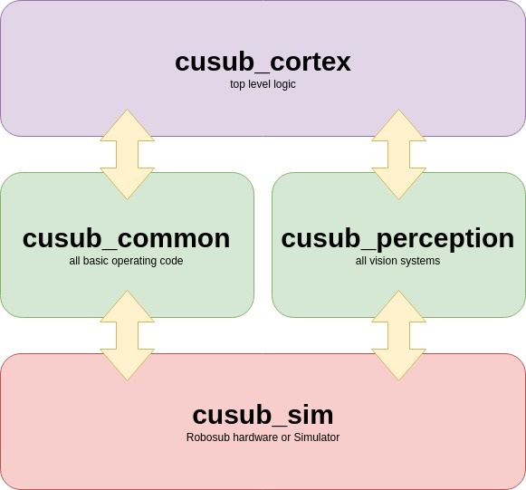

.. CU_RoboSub documentation master file, created by
   sphinx-quickstart on Sat Feb  2 19:51:43 2019.
   You can adapt this file completely to your liking, but it should at least
   contain the root `toctree` directive.

Welcome to CU RoboSub's software documentation!
===============================================

Welcome to the CU Robosub software documentation page.
The goal for this site is to provide a centralized location for all software related documentation to be stored, this includes: installation, deployment, code style, comment style, repository rules, ROS topic interfaces, as well as many more pertinent details for developing code for the sub.

If you have any questions or concerns be sure to attend our regulary scheduled `Software meetings <https://www.colorado.edu/studentgroups/roboticsclub/robosub/robosub-calendar>`_ or ask questions within the `software channel <https://cu-robotics.slack.com/messages/C1DR5UJHG/>`_ of our slack  

*******************************
RoboSub Architecture and Design
*******************************

Robosub System Inteconnect Model (RSIM)
#######################################

The software is structered loosly around the Open System Interconnect Model (OSI). Each package can communicate with the packages above and below them but they cannot "skip" a layer or or communicate with packages laterally.

   
   
   
.. toctree::
   :maxdepth: 1
   :caption: Contents:

   cusub_sim
   cusub_common
   cusub_perception
   cusub_cortex
   git_rules

Indices and tables
==================

* :ref:`genindex`
* :ref:`modindex`
* :ref:`search`
